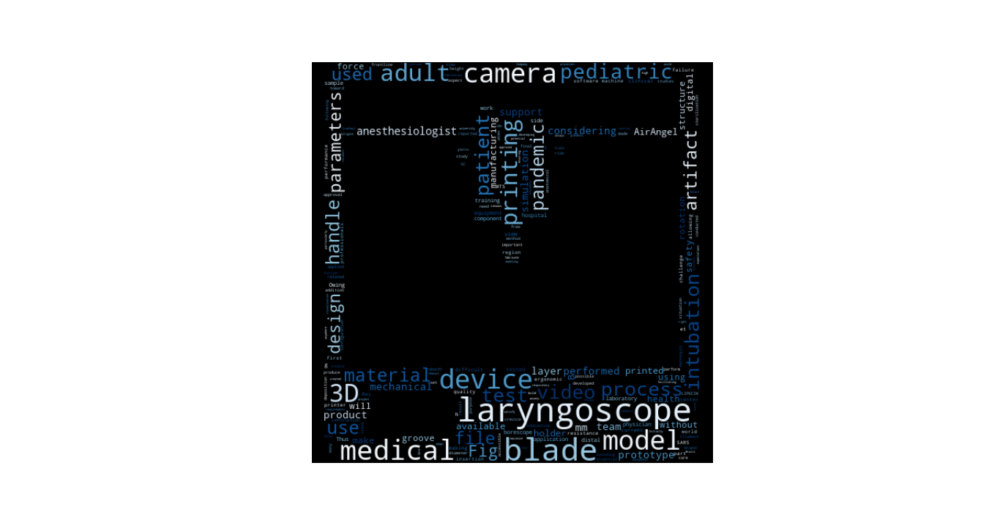

# 📊 Análise de Texto e Nuvem de Palavras com Máscara Personalizada

Este repositório contém um projeto de análise de artigos científicos e visualização de dados por meio de uma nuvem de palavras personalizada. A ideia surgiu da minha participação no artigo *"Three-Dimensional Printed Laryngoscopes as Allies Against COVID-19"*, onde contribuí com a alocação de artefatos na plataforma **LIPECIN** para distribuição de arquivos de impressão 3D.

O artigo abordou a criação de laringoscópios de baixo custo utilizando impressão 3D, visando suprir a falta de equipamentos médicos durante a pandemia de COVID-19. Como parte desse projeto, ajudei na disponibilização de arquivos de impressão 3D, permitindo que hospitais e profissionais ao redor do mundo pudessem acessar e fabricar os dispositivos.

Inspirado nesse contexto, desenvolvi este projeto para analisar textos de artigos científicos e destacar automaticamente seus principais termos através de uma nuvem de palavras em formato personalizado. A máscara utilizada na nuvem pode representar objetos relevantes ao estudo, como uma impressora 3D, tornando a visualização mais intuitiva e impactante.

## 🚀 Funcionalidades
- Extração automática de conteúdo de artigos científicos
- Processamento de texto para identificar palavras mais frequentes
- Geração de nuvem de palavras com máscara personalizada
- Suporte para análise de diferentes artigos e temas

## 🛠 Tecnologias Utilizadas
- **Goose3** → Extração de artigos da web
- **NLTK** → Processamento de texto e remoção de stopwords
- **WordCloud** → Geração da nuvem de palavras
- **PIL & OpenCV** → Manipulação da máscara personalizada
- **Matplotlib** → Exibição da visualização

## 📷 Exemplo de Resultado
Aqui está um exemplo de nuvem de palavras gerada com uma máscara personalizada:

## 💡 Por que este artigo?
Minha escolha por esse artigo se deve à minha participação ativa na pesquisa e no desenvolvimento da plataforma **LIPECIN**, que tornou os arquivos de impressão 3D acessíveis globalmente. Ele representa um exemplo prático de como a tecnologia pode ser usada para solucionar problemas reais e democratizar o acesso a dispositivos médicos essenciais.

Este projeto une **processamento de linguagem natural (NLP), ciência de dados e visualização interativa**, demonstrando o poder da análise automatizada para facilitar a compreensão de textos científicos.

🔗 **Leia o artigo completo**: [Three-Dimensional Printed Laryngoscopes as Allies Against COVID-19](https://pmc.ncbi.nlm.nih.gov/articles/PMC10599427/)
